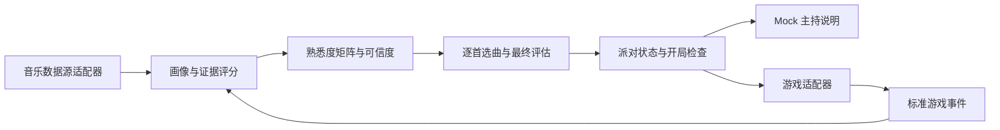

# 仓库与架构选择

状态：首期架构文档基线；本次没有安装应用框架或建立服务。依据：[需求规格](requirements.md)。

本页保留架构选型依据。后续开发统一进入[详细实现架构](implementation-architecture.md)，并依次使用[算法规格](algorithm-spec.md)、[派对运行规格](party-runtime-spec.md)与[实施工作单](implementation-plan.md)。细化文档接受后，B 为首期执行方案；不再把以下 A/B/C 对比当作未决选型。新增公式和工程默认值是待实现验证的约定，不改变已合并 REQ/AC。

## 可选仓库方案

| 方案 | 仓库组织与运行方式 | 优点 | 代价与适用条件 |
| --- | --- | --- | --- |
| A：单应用模块化 | 一个 TypeScript 应用，`src/` 内按领域分模块，单进程 | 启动最少、跨模块调试简单 | 适合只做短期 CLI 或单一页面；以后 Web、服务端和 Karuta 复用契约时容易出现入口耦合 |
| B：轻量 pnpm Monorepo（推荐） | 一个仓库，少量 workspace 包；首期 Demo 单进程，后期 Web 与单个服务端 | 模型、算法、主持、适配可以独立测试，一次 PR 原子更新契约，兼容现有 React/TS/Node 技术方向 | 要维护依赖方向和包出口，但不需要微服务、包发布平台或复杂构建编排 |
| C：多个独立仓库 | 领域/选曲库、派对服务、UI/游戏各自仓库及版本 | 适合独立团队、发布周期与权限边界已明确的长期产品 | 首期容易被跨库版本、发布和联调拖慢，契约仍在变化时收益小；此时不推荐 |

仓库数量与运行进程数量是两个决策。Monorepo 不等于微服务，多仓库也不天然提供可扩展性。首期没有服务容量或独立扩缩容证据，不需要 Kafka、Kubernetes 或服务网格。

已有 Karuta 仓库暂时保持独立，通过游戏适配器接入；不为统一目录而复制历史、移动源码或重构游戏。未来确认可复用边界后，再决定是否把某个共享包迁入本仓库。

## 推荐 B 的依据与边界

现在最需要验证的是规则是否正确、不同背景是否得到合理覆盖、ban 后能否诚实处理。画像、选曲和开局判定需要大量不依赖 UI 的确定性测试；轻量工作区把这些模块与外部数据源、真实游戏协议隔开，同时避免跨仓库发版。

首期只增加有实际代码的目录，建议初始边界为：

```text
apps/
  demo/                 # CLI 闭环、场景编排和可读输出
packages/
  core/                 # song/player/party、开放标签契约、游戏/主持共用类型
  music-profile/        # 证据标准化后的画像、评分、可信度、矩阵
  playlist-engine/      # 逐首选择、公平评估、真实贡献解释
  party-runtime/        # 状态迁移、评估版本、房主确认、开局校验、Mock 主持
  adapters/             # sources/mock 与 games/mock-karuta；外部接入按子模块隔离
docs/
tests/                   # 跨包场景；局部单元测试贴近被测模块
```

`music-taxonomy` 先作为 core 中的开放契约，不单独建只放少量类型的空包；`ai-host` 先作为 party-runtime 的可替换模块；只有真实复用需求出现后再拆包。避免创建无明确归属的 shared 杂物包。业务算法仍按原 Prompt 的领域划分，包数减少不意味着把职责混在一起。

数据流：



依赖方向：core 不依赖其他业务包；music-profile 和 playlist-engine 依赖 core，选曲通过矩阵输入而不直连数据源；party-runtime 依赖 core 与选曲/评分能力；adapters 实现 core 契约，不反向控制 runtime。demo 是组合入口，注入来源、游戏与主持实现。所有包禁止依赖应用入口；核心不得读取网络、平台 Cookie 或环境密钥。

## 运行接口与状态所有权

| 边界 | 最小接口/责任 | 首期运行方式 |
| --- | --- | --- |
| 数据源 → 画像 | `MusicProfileSource` 返回标准化可处理的数据，来源保留在证据中 | 内存 Mock，无网络 |
| 画像 → 选曲 | 玩家/歌曲 ID、评分与可信度矩阵、配置/画像版本 | 显式参数，无隐藏全局状态 |
| 选曲 → 派对 | `SelectionResult`、逐首贡献、独立公平评估 | 同进程函数调用 |
| 派对 → 主持 | 状态与结构化评估 → 白名单 `HostDecision` | Mock 文案；Agent 无状态真值写权限 |
| 房主 → 派对 | 明确选择与当前评估版本 | 测试/CLI 模拟；未来由服务端验证房主身份 |
| 派对 → 游戏 | `MusicGame`、标准事件、启动/停止 | Mock 适配器；启动前强制检查 |

party-runtime 是派对状态的唯一写入入口，生成版本、保存告警、处理确认并判断能否开局。选曲器不自动启动游戏，主持文案不直接改变真值，游戏计分不由 LLM 裁决。评分与选曲输入必须包含显式参考时间或固定时钟，保证同一完整输入可复现。

未来实现浏览器房间时增加 `apps/web`（React/Vite）和 `apps/server`（Node.js），运行时状态由服务器持有；浏览器提交意图，服务端验证角色、版本与规则。REST 用于房间/画像/选曲操作，WebSocket 用于房间和游戏事件；具体端点在真实房间 Issue 确定，本文不虚构已经存在的 HTTP API。

## 技术与演进选择

- 首期：pnpm workspace、TypeScript strict、Vitest、ESLint、Prettier；工作区引用共享类型，边界校验优先使用 Zod，纯算法内部不重复堆叠解析。实现时锁定并记录 Node LTS 与 pnpm 版本，提交 lockfile，不在本次文档阶段伪造已安装版本。
- 状态先在内存，无数据库。只有需要跨重启恢复、账户或多人并发持久化时再通过 ADR 选择存储；`.env.example` 的预留名称不是数据库上线要求。
- 不立即增加 Nx/Turborepo；若实测构建/测试耗时成为问题，再评估任务缓存。不能把增加构建框架当作用户功能。
- 当模块有独立团队、稳定发布接口或跨项目消费者时考虑拆独立包/仓库；当实测负载或故障隔离要求独立部署时才拆服务。仅凭“以后可能变大”不拆。
- 真实平台接入先解决官方能力和素材可用性，真实 Karuta 先确认事件与状态所有权；接入不得倒置核心依赖或绕过公平检查。

## 决策记录

选择建议：B。代价是少量 workspace 配置，收益是规则可测试、契约可原子修改、现有游戏可以渐进接入。A 作为极短期一次性原型仍合理；C 留到独立发布与团队边界出现时。

文档合并仅确定文档基线与架构方向，不表示玩法效果已验证，也不批准生产部署。后续若改变选择，应在关联 Issue 或 PR 记录，并同步改路线图与契约归属，不能继续让两套方案同时成为实现指令。
