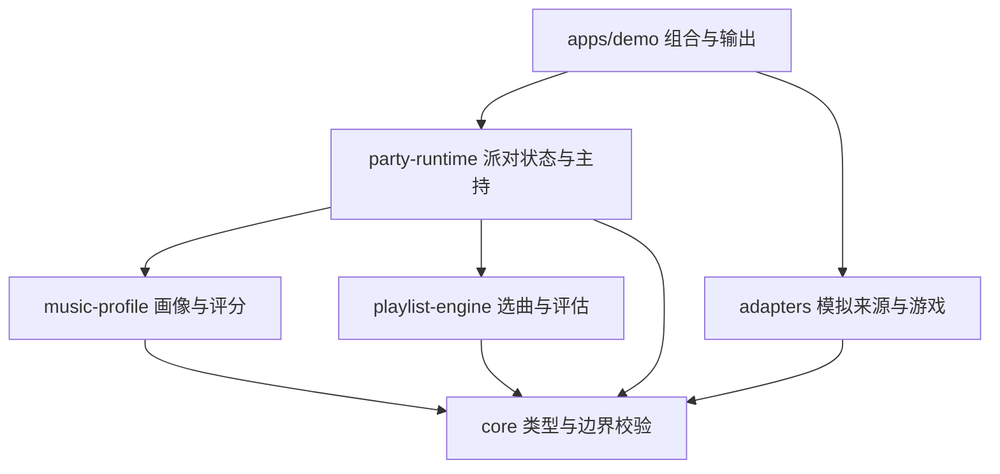

# 首期实现架构 v1

本文把已合并的[需求规格](requirements.md)转成可执行的开发约定。范围是 Issue #4 的 M1–M5，无业务代码已实现的含义。本文新增的实现选择随本次文档 PR 接受后成为开发基线；已合并的 REQ 和 AC 始终有效。

2026-09-24 补充：[初赛可玩 Demo 架构](preliminary-demo.md)增加真人画像采集、可玩题目、多人/1v1 与赛事。本文“首期”均指 M1–M5 核心 Mock，完整初赛目标还包括补充中的 D 阶段；不再以 CLI 通过作为真人可玩完成标准。初赛不接大模型，使用规则选曲和系统主持。

## 1. 阅读与决策顺序

新的开发者按以下顺序阅读：`AGENTS.md` → `docs/project-state.md` → Issue #4 最新清单、Checkpoint 和关联 PR → `requirements.md` → [初赛范围补充](preliminary-demo.md) → 本文 → [算法规格](algorithm-spec.md) → [派对运行规格](party-runtime-spec.md) → [实施工作单](implementation-plan.md) → `acceptance.md`。

需求规定产品行为，本文规定模块和数据归属，算法/运行规格规定确定性计算和流程，工作单规定实施顺序，验收矩阵规定交付证据。原 Prompt 快照仅用于追溯，不能再执行其初始化指令覆盖现有仓库。

遇到文档冲突，保持已合并 REQ/AC 的行为，在当前 Issue/PR 记录冲突并修订文档后再更改实现。允许自主决定函数内部拆分和测试辅助工具；包边界、公开契约、公式、状态规则、验收条件的变更必须同 PR 更新对应规格，不得静默换方案。

## 2. 首期交付与系统边界

首期是一套本地、单进程、内存运行的音乐派对模拟系统。无 API Key、数据库、真实音频、浏览器、平台网络请求或真实 LLM 也能运行。安装依赖可能联网；业务 Demo 本身不联网。

一次完整演示完成：加载模拟数据 → 生成画像 → 计算矩阵 → 选曲并评估 → 主持说明 → 模拟房主处理禁歌/告警 → 模拟游戏 → 收集证据 → 下一轮重新评分与选曲。模拟玩家行为由独立脚本提供，不能直接把熟悉度评分当成答题结果，否则只是在自证模型。

真实 Karuta 保持原仓库，未来通过适配器接入。本仓库当前不包含其代码，不假设其协议已经确认。QQ 只作为未来来源，歌曲语言、地区、风格和文化没有默认优先级。

初赛层复用这些包，另增加 web/server 组合入口。Party、Match、GameSession、Tournament 分层；来源包括手动输入；Song/Recording/Question/Card 分离。具体契约、玩法与 D0 引擎核对见初赛补充，不在核心 Mock 阶段预建空页面、空赛事包或模型 SDK。

## 3. 运行结构与依赖



箭头表示代码依赖，不表示事件流。runtime 通过 core 接口接收已注入的来源/游戏/主持，不导入 adapters。M1–M5 的 demo 是唯一组合入口；可玩 D 阶段由 server 作为另一组合入口，web 不拥有状态真值。playlist-engine 只读取已计算矩阵，不调用 music-profile。

| 包名 / 路径 | 拥有的职责 | 不得承担的职责 |
| --- | --- | --- |
| `@amp/core` / `packages/core` | 稳定 ID、领域类型、Zod 边界 schema、配置契约、来源/游戏/主持接口 | 网络、文件、环境变量、业务评分或选曲 |
| `@amp/music-profile` / `packages/music-profile` | 证据归并、画像构建、评分/可信度、矩阵、反馈转证据 | 选曲、改变派对状态、打印输出 |
| `@amp/playlist-engine` / `packages/playlist-engine` | 候选过滤、逐首选择、指标、独立评估、计算解释 | 获取平台数据、修改画像、开局 |
| `@amp/party-runtime` / `packages/party-runtime` | 状态唯一写入口、版本、命令、开局检查、事件消费、Mock 主持 | 具体平台协议、Karuta 判定算法、伪造房主确认 |
| `@amp/adapters` / `packages/adapters` | MockMusicSource、MockKarutaGameAdapter、合成数据与脚本 | 决定派对是否公平、直接写 PartyState |
| `@amp/demo` / `apps/demo` | 创建依赖、场景脚本、命令行参数、文本/JSON 报告 | 重写公式、补写假指标、成为被业务包依赖的库 |

## 4. 文件归属

这是目标布局，按阶段创建含实际内容的文件，不预建空包。

```text
apps/demo/src/
  index.ts                   # CLI 参数、退出码
  run-scenario.ts             # 组合来源、runtime、游戏、主持
  scenarios/                 # mixed / stress / ban / feedback 场景流程
  reporters/                 # 同一报告对象转 text 或 JSON
packages/core/src/
  index.ts
  ids.ts                     # ID 类型与格式约束
  taxonomy.ts                # 开放标签注册表与层级校验
  song.ts                    # 歌曲、艺人
  player.ts                  # 玩家、偏好、画像
  evidence.ts                # 标准证据判别联合
  familiarity.ts             # 评分、解释、矩阵
  selection.ts               # 请求、步骤、评估结果
  party.ts                   # 状态、版本、房主选择
  ports.ts                   # MusicProfileSource / PartyHostAgent
  game.ts                    # MusicGame / GameEvent / GameResult
  config.ts                  # 配置 schema 和版本类型
packages/music-profile/src/
  normalize-evidence.ts      # 去重、校验、快照/事件归并
  build-profile.ts
  score-familiarity.ts
  build-matrix.ts
  gameplay-evidence.ts
  defaults.ts                # 唯一评分默认配置
packages/playlist-engine/src/
  filter-candidates.ts
  objective.ts               # 四项目标与边际增益
  select-playlist.ts
  assess-playlist.ts          # 可独立用于 ban 后检查
  explain-selection.ts
  defaults.ts                # 唯一选曲/公平默认配置
packages/party-runtime/src/
  create-runtime.ts
  commands.ts
  version.ts
  start-guard.ts
  consume-game-event.ts
  mock-party-host.ts
packages/adapters/src/
  sources/mock-music-source.ts
  games/mock-karuta.ts
  fixtures/                  # 歌曲、玩家输入、事件脚本、数据清单
tests/integration/           # 跨包和 AC 场景
```

每包有 `src/index.ts` 公共出口和贴近源码的 `*.test.ts`；不要从别包 `src/` 深层路径导入。fixtures 用独立子路径出口 `@amp/adapters/fixtures`，不会被 core 间接加载。集成测试通过根 Vitest 配置执行。

## 5. 工程约定

- Node 24 LTS、pnpm 10，ESM，TypeScript strict。M1 选择仍受维护的具体补丁版本，记录于 README 和版本文件；`packageManager` 精确固定 pnpm，提交 lockfile。其他依赖在 M1 安装时固定可兼容的具体版本，不使用浮动 `latest` 作为可复现依据。
- `module` / `moduleResolution` 使用 NodeNext，内部相对导入写 `.js`；TypeScript project references 构建各包的 `dist` 和声明。workspace 包通过 `workspace:*` 依赖，出口指向构建产物。
- 开启 `strict`、`noUncheckedIndexedAccess`、`exactOptionalPropertyTypes`；核心公共数据用只读类型，公开结果返回副本，避免调用者绕过 runtime 修改状态。
- Zod 只在入口验证来源、配置、命令和游戏事件；由 schema 推导同一份类型，避免 schema 和手写类型漂移。纯算法接受已校验结构，不反复解析整个矩阵。
- ESLint 检查类型与包依赖边界；Prettier 管理新增 TS/配置格式。保留 Python 文本检查和 `git diff --check`。M1 配置格式工具时检查现有 Markdown，避免引入无关批量重排。
- `pnpm build` 用 `tsc -b`；`pnpm typecheck` 检查业务及测试；`pnpm test` 先构建再 `vitest run`，禁用“零测试也成功”；`pnpm lint` 包括 ESLint 与格式检查；M5 的 `pnpm demo` 先构建再启动 demo 的 JS 入口。不依赖隐式执行顺序或全局安装的 tsx。
- M1 CI 运行冻结 lockfile 安装、build、typecheck、test、lint、Python 检查；M5 增加默认 demo 和结构化输出验证。Windows 和 Linux 至少各验证一次 M5；CI 可用双系统矩阵。

## 6. 基础数据约定

ID 是非空、无前后空白的稳定字符串，按 SongId、PlayerId、ArtistId、TagId、PartyId、EventId 分别声明类型。展示名称与 ID 分离。平台 externalId 不能直接当跨平台 SongId。重复 ID 或同 ID 内容冲突应拒绝，不能最后一条静默覆盖。

时间为 UTC ISO 字符串，边界解析并验证；计算注入 `referenceTime`，不读取 `Date.now()`。计数为非负安全整数，所有数值拒绝 NaN/Infinity，评分/可信度/偏好/热度在 `[0,1]`。字段缺省表示未知；空数组表示已知列表为空，两者均不产生负面偏好。

| 类型 | 必需内容 | 可选内容 / 规则 |
| --- | --- | --- |
| `TaxonomyTag` | id、dimension、label | parentId 仅同维度，拒绝环；dimension 是有限字段名，标签值开放 |
| `ArtistProfile` | id、name | originRegionIds；艺人地区不能复制成歌曲语言 |
| `SongProfile` | id、title、artistIds、genres、languages | regions、cultures、scenes、franchises、releaseYear、popularity、source；艺人/语言非空，genres 可空并视为未知 |
| `Player` | id、displayName | 不含“华语型”等固定用户分类 |
| `PreferenceDimension` | 标签到 `{weight, confidence}` 的映射 | 缺失键为未知，画像 UI 可汇总但不能反推固定用户类型 |
| `PlayerMusicProfile` | playerId、profileVersion、八维偏好、songEvidence、artistEvidence、confidence | explorationScore、mainstreamScore；总体 confidence 仅展示，不代替逐歌曲可信度 |
| `RawUserMusicData` | sourceId、userId、schemaVersion、snapshotId、observedAt、evidence、declaredPreferences | “Raw”指未构建画像的标准来源数据，不允许 QQ 原始响应穿透到业务核心 |

八维为 genres / artists / languages / regions / eras / cultures / franchises / scenes。艺人映射使用 ArtistId，其余使用 TagId。年代由发行年份向下取十年段，例如 1890s，不能限制为 1960s 起。未知年代不虚构标签。taxonomy 注册表允许运行时新增标签；未知引用先由来源显式注册，维度冲突或未注册引用作为数据错误。

## 7. 证据、评分与矩阵契约

`Evidence` 是带 type 的判别联合，共同字段为 `evidenceId, playerId, sourceId, observedAt`，按类型携带 songId 或 artistId，以及必要的 value / occurredAt。具体归并、时效和公式见[算法规格](algorithm-spec.md)。保留原始来源 ID 以便解释，不存 Cookie、token 或真实个人资料。

`FamiliarityEstimate` 包含 `familiarityScore, confidence, evidenceStatus: known | insufficient, reasons`。reasons 是结构化贡献列表，每项有 feature、evidenceIds、transformedValue、weight、contribution；额外记录 clamp / correctFloor 等修正，使最终数值可重算。文案从结构生成。

`FamiliarityMatrix` 包含 schemaVersion、matrixVersion、referenceTime、scoringConfigVersion、按玩家的 profileVersion、排序后的 playerIds/songIds、以 ID 索引的完整 cells。所有玩家 × 候选歌曲都必须有 cell；无证据也有低可信度 cell，缺 cell 是程序错误而非零分。同一快照排序稳定；禁止用数组下标在两个不同排序中关联身份。

公开纯函数：

```ts
normalizeEvidence(input, catalog, referenceTime): NormalizedEvidence
buildPlayerProfile(input, catalog, taxonomy, config, referenceTime): PlayerMusicProfile
scoreFamiliarity(profile, song, config, referenceTime): FamiliarityEstimate
buildFamiliarityMatrix(profiles, songs, config, referenceTime): FamiliarityMatrix
```

这些是接口签名草图，M1/M2 用本文定义的结构落实具体类型，不将 `any` 留在实现中。

## 8. 选曲与评估契约

`SelectionRequest` 包含 players、profiles、candidateSongs、完整 matrix、requestedCount、bannedSongIds、excludedHistorySongIds、availability、selectionConfig、fairnessConfig、selectionVersion、gameType、roundNumber。profiles 只供上下文多样性/探索偏好计算；歌曲熟悉度始终取 matrix。

`SelectionResult` 包含 selectedSongIds（有序）、steps、requestedCount、actualCount、excludedCounts（按原因）、unfilledCoverage、objectiveSummary、fairnessAssessment、inputVersions。每个 step 保存加入前后 K(u)、补缺收益、四项边际增益、软比例贡献、综合增益和同分决胜依据。被 ban 后保留原选择步骤作为历史，另生成当前题组评估，不能伪造一次新选择的贡献。

`FairnessAssessment` 包含 selectionVersion、matrixVersion、完整 fairnessConfig 与版本、requestedCount、actualCount、validity、passed、playerMetrics、maxCoverageGap、reasons。playerMetrics 包含 K/C/F/L 四项；无玩家或空题组的比例与差距用 null，不用 NaN 或虚构的零。

原因使用判别联合：`NO_PLAYERS / EMPTY_PLAYLIST / LOW_COVERAGE / COVERAGE_GAP / LOW_CONFIDENCE / SHORT_PLAYLIST`，携带 playerIds、observed、threshold 等适用字段。非法数值、重复 ID、缺矩阵项等作为 `INVALID_INPUT` 错误，在计算前拒绝。合法空输入产生不可开局的 assessment，便于主持解释。

```ts
selectPlaylist(request): SelectionResult
assessPlaylist(input): FairnessAssessment
```

assessPlaylist 不调用 selectPlaylist；独立接受最终有序题组、玩家、矩阵、请求长度、配置及版本，支持禁歌后的重新检查。公平检查不依赖选曲步骤报告的结论。

## 9. 派对、游戏与主持边界

完整状态、命令表、版本和事件规则见[派对运行规格](party-runtime-spec.md)。以下为不可倒置的边界：

- `MusicProfileSource.getUserMusicData(userId)` 返回 Promise；初始化/显式刷新时加载，选每一首时不重复访问来源。歌曲库由独立 catalog 输入提供。
- `PartyHostAgent.decide(context)` 返回 Promise<HostDecision>，输入只读快照、画像、评估和游戏结果。Mock 主持输出白名单建议；runtime 才能执行动作。
- `MusicGame.start(): Promise<void>`、`getState()`、`getResult()`、`stop(): Promise<void>` 保留通用形状。由 `GameFactory.create(sessionInput, onEvent)` 创建绑定本局输入的实例，以免 start 无参数时靠全局状态传递题组。
- GameSessionInput 固定 gameSessionId、partyId、selectionVersion、playerIds、songIds、gameType。getResult 在未结束时返回 `not_finished`，不得返回假结果。
- 游戏适配器拥有其内部判定/分数；runtime 拥有派对和开局许可。结果通过校验事件及最终结果进入历史，主持没有计分写权限。

## 10. 错误、可复现性与观测

公共运行操作返回 `Result<T, DomainError>`；错误至少含 code、message、details，不能用异常文本作为业务分支。未知编程错误在应用边界捕获，报告失败且非零退出；不得伪装成公平告警。输入无效、旧版本、非房主、未评估、ban 未结束、不支持玩法、游戏失败要可区分。

所有影响结果的输入均进入运行报告：数据集版本、taxonomy 版本、画像/评分/选曲/公平配置版本、referenceTime、玩家与歌曲 ID、命令和事件顺序。公平选曲不使用随机排序；可玩模式在冻结题组内用有种子的洗牌决定播放顺序，详见初赛补充。脚本若需要随机性必须注入种子并记录。排序不用随系统语言变化的 localeCompare。

日志仅由 demo 输出；包返回结构化结果。报告不输出密钥或真实个人数据。默认内存运行，不自动持久化；JSON 输出通过 CLI 标准输出，调用者自行保存。临时产物不提交。

## 11. 明确暂缓的实现

对 M1–M5 核心 Mock，Web/REST/WebSocket、真实音频和 Karuta 适配仍不属于验收内容；它们已纳入初赛补充的 D0–D4，不再作为无限期未决方向。真实账户、数据库、正式部署和 QQ 官方接入仍暂缓；真实 LLM 明确不在初赛范围。server 持有 runtime，将服务器验证的会话身份注入命令；web 只提交意图并显示结果；来源适配器将平台响应转标准证据；游戏适配器转换原协议。具体真实契约经 D0 核对后落地，不提前写虚构端点。

首期 Mock actor 校验只能证明角色规则，不能宣称实现了联网认证。规则权重是试验值，受控 Demo 不能证明真实识别概率或真实派对公平。
