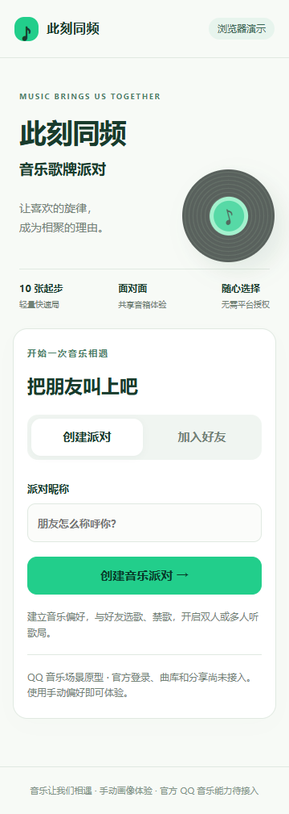
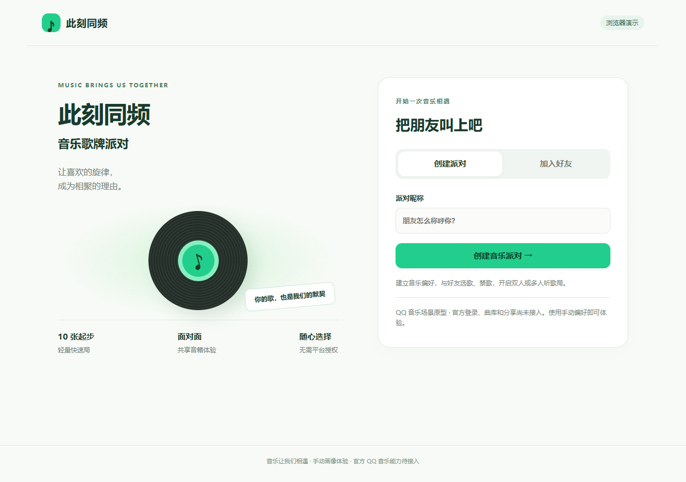

# 此刻同频：作品名称与主页文案

2026-10-07，用户在 Issue #33 的 UI 收尾阶段确认本次命名，独立任务为 #76。

- 作品名：**此刻同频**。
- 副标题：**音乐歌牌派对**。
- Slogan：**让喜欢的旋律，成为相聚的理由。**

主页将名称作为主标题，副标题紧接在名称下方，随后展示 slogan。导航链接及其无障碍名称、浏览器标签页、页面摘要、核心 CLI 标题、服务启动提示、README 和现行需求/演示文档均使用新名称。保留既有创建/加入、偏好和对局流程。

仓库地址、内部包名与环境变量是运行标识，继续兼容现有克隆、导入及部署；没有重命名 GitHub 仓库或服务账户。原始需求来源快照、带哈希的历史证据和旧截图保持原样。一般性的「音乐派对」「创建派对」是玩法与动作说明，不按旧品牌机械替换。

本次仅更名与主页文案调整，不改变音频、选曲或比赛规则，也不表示 #33 的完整 UI 验收完成。公网部署需采用最终审核版本，不能用当前 main 覆盖尚未合并的 PR #72 音频修复。

## 验证

使用仓库已有 Node 24.21.0 / pnpm 10.34.5，构建、类型检查、全仓 lint/格式、CLI 进程验证和仓库/diff 检查通过。CLI 既有检查同步读取新标题，四个场景、JSON/文本输出及错误参数行为保持通过。

静音 Chrome 核对 360/390/430px 和 1280px：新名称、副标题、slogan、导航无障碍名称与浏览器标题正确，页面无横向溢出；副标题手机为 18px、桌面为 22px。两个独立客户端实际创建/加入同一房间并进入大厅，导航继续显示新名称，无页面异常。已目视核对手机与桌面截图；本轮不执行音频播放、完整对局或 QQ 真机验收。

