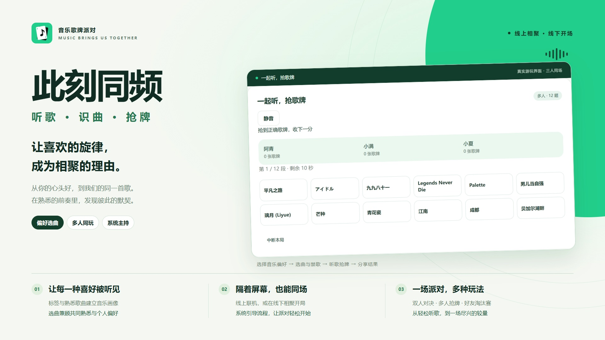

# 此刻同频 · 品牌与展示素材

这里保存已交付的设计成品与可编辑源文件，随 PR #77 版本管理；临时浏览器记录和会话数据仍留在被忽略的 `output/playwright/` 中，不提交。

## 图标

[`cike-tongpin-icon/`](cike-tongpin-icon/) 包含 SVG 源文件、1024/512/64/32px PNG 导出及组合预览。SVG 与网站使用的 [`brand-icon.svg`](../../apps/web/public/brand-icon.svg) 内容一致。导航和 favicon 使用新图标，主页中间保留唱片装饰。

## 官网展示封面

[`cike-tongpin-cover/`](cike-tongpin-cover/) 包含 4K PNG、1920px JPG、独立可编辑 HTML、用于排版的真实对局截图及脱敏游玩报告。详细尺寸、适用范围和验证边界见[使用说明](cike-tongpin-cover/使用说明.md)。

